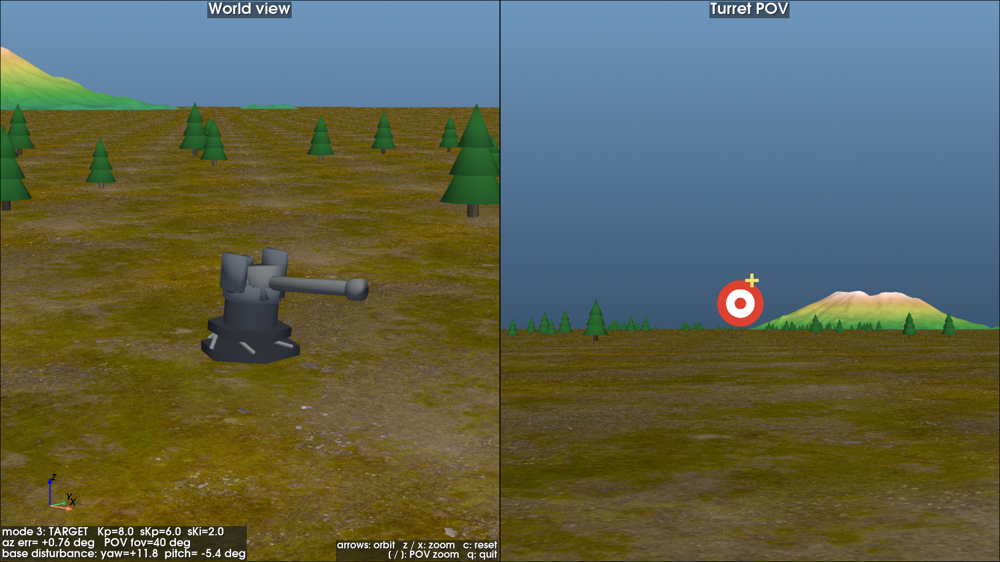
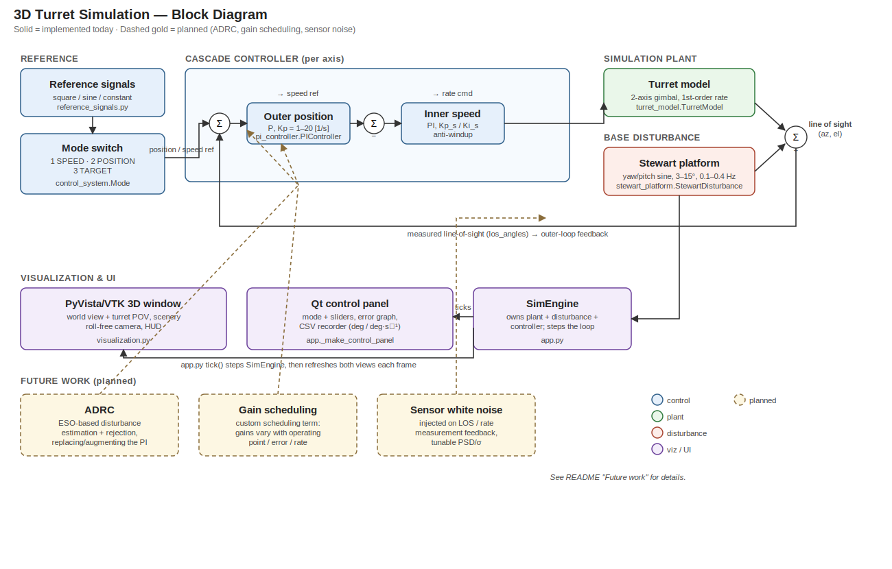

# 3D Turret Simulation

A real-time 3D simulation of a 2-axis (azimuth/elevation) turret tracking a
static target board, with a disturbed base and a cascade control system.



*World view (left) and turret POV (right) in TARGET mode, holding on the
board while the Stewart-platform base disturbance (yaw +11.8°, pitch −5.4°)
is rejected.*

## What it does

- **Turret plant**: a 2-axis gimbal (azimuth/elevation) with first-order rate
  dynamics, mounted on a **Stewart platform** that injects sinusoidal yaw/pitch
  base disturbances (magnitude 3–15°, frequency 0.1–0.4 Hz) — the controller
  has to reject this to keep the line of sight steady.
- **Cascade control**: an outer position loop (P, Kp 1–20) wrapped around an
  inner speed loop (PI). Everything regulates the *line of sight* (base
  disturbance + gimbal), i.e. gyro-style stabilization.
- **Three control modes**:
  1. **SPEED** — direct speed reference (deg/s).
  2. **POSITION** — degree reference (square / sine / constant), full cascade.
  3. **TARGET** — auto-aim: the barrel/target position error feeds the
     position loop.
- **Visualization**: a real-time PyVista/VTK 3D world view (turret, forest,
  distant mountains from a real elevation model, textured ground) plus a
  turret-mounted POV camera with a target reticle.
- **Secondary Qt control window**: mode switch, all control and disturbance
  sliders, a live error-signal graph (adapting units to the active mode), and
  a data-logging panel that exports error / control input / disturbance to CSV
  in one consistent unit family (deg, deg/s).

## Running it

```bash
uv sync
uv run python app.py
```

Two windows open: the main 3D window (world view + turret POV) and the Qt
control panel. Keyboard controls the world camera — arrow keys orbit
(yaw/pitch only, no roll), `z`/`x` zoom, `c` resets the view, `[`/`]` zoom the
turret POV.

## Tests

```bash
uv run python tests/test_system.py
```

Standalone system tests (no framework) covering the controller, disturbance
model, line-of-sight composition, all three control modes, disturbance
rejection, the CSV recorder, camera behavior, tree placement, and a headless
render smoke test.

## Project layout



Reference signals and the mode switch feed the per-axis cascade controller
(outer position P, Kp 1–20, wrapping an inner speed PI). Its rate command
drives the turret plant; the plant's gimbal angles compose with the Stewart
platform's base disturbance into the line of sight, which feeds back to the
outer loop. `SimEngine` (in `app.py`) owns all of this and ticks both the
PyVista 3D window and the Qt control panel each frame.

See [CLAUDE.md](CLAUDE.md) for the full architecture, conventions, and scope.

## Future work

Planned next (see the dashed boxes in the diagram above):

- **ADRC (Active Disturbance Rejection Control)** — an extended-state-observer
  based controller to estimate and cancel the Stewart-platform disturbance
  (and other unmodeled dynamics) directly, as an alternative or complement to
  the current PI cascade.
- **Custom gain scheduling** — a scheduling term that varies Kp/Ki with the
  operating point (e.g. error magnitude, axis rate, or disturbance amplitude)
  instead of the fixed gains used today.
- **Sensor white noise** — inject tunable-variance white noise on the
  line-of-sight / rate measurements feeding the control loop, so the
  controllers (and future ADRC/gain-scheduling work) have to cope with
  realistic sensor imperfection, not just the clean disturbance signal.
